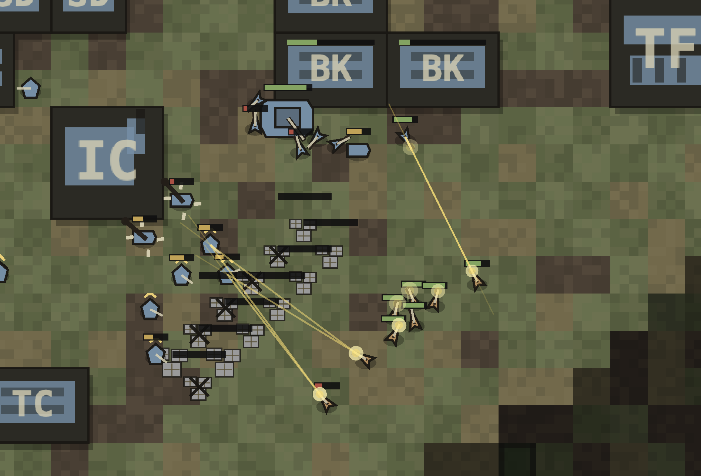

# Bewegungskrieg



Bewegungskrieg is a small real-time-strategy game inspired by classic base-building RTS games.
Gather steel and oil, expand your base, train an army, scout through fog of war, and defeat the
other players.

The game is server-authoritative: a Rust server owns the simulation, serves the static browser
client, and streams fog-filtered snapshots over WebSocket. The client is plain HTML/CSS/JS with
PixiJS loaded from a CDN, so there is no JavaScript build step.

For architecture, protocol, balance, hardening rules, and module contracts, start with
[DESIGN.md](DESIGN.md), then follow the relevant `docs/design/` link. This README is only the
quickstart.

## Play Locally

Requirements:

- A recent Rust toolchain with `cargo`
- A browser with WebGL enabled

Start the server:

```bash
./runserver
```

Open the URL printed by the server, usually `http://127.0.0.1:8080/` or
`http://localhost:8080/`.

To change the bind address:

```bash
RTS_ADDR=127.0.0.1:8090 ./runserver
```

## Starting A Match

Open the game in one or more browser windows.

- Join the same room to play together.
- The host can add AI opponents from the lobby.
- All human players must ready up before the host starts the match.
- A one-player match with no AI is a never-ending sandbox.
- The lobby's "Start with more money mode" gives every player a larger opening economy.

Matches support up to four total players, counting humans and AI.

## Game Basics

- Engineers gather steel and oil.
- Buildings let you increase supply and unlock new units.
- Units can move, attack, attack-move, stop, gather, build, and train through the command card.
- Fog of war is enforced by the server, so hidden enemies are not sent to the client.
- Last player standing wins in matches with two or more players.

## Controls

| Action | Input |
|--------|-------|
| Select unit or building | Left-click |
| Box-select | Left-drag |
| Move, gather, or attack | Right-click |
| Command card | Q W E / A S D / Z X C |
| Pan camera | WASD, arrow keys, screen edge, or minimap drag |
| Zoom | Mouse wheel |
| Cancel placement | Esc or right-click |

## Developer Quickstart

Useful entry points:

- `server/` contains the Rust server and authoritative simulation.
- `client/` contains the static browser client served by the Rust process.
- `tests/` contains live-server integration and browser smoke tests.
- [DESIGN.md](DESIGN.md) indexes the source-of-truth contract docs under `docs/design/`.
- [tests/README.md](tests/README.md) explains the test suites in detail.

Common commands:

```bash
# Run the game.
./runserver

# Build, lint, and format the Rust crate.
cd server && cargo build && cargo clippy && cargo fmt

# Run the full test orchestrator from the repo root.
tests/run-all.sh
```

The full test runner starts or reuses a local server, runs the Rust simulation tests, runs the
WebSocket/API suites, and runs the headless client smoke test when Chrome is available.

For focused test runs, see [tests/README.md](tests/README.md).

## CI And Local Hooks

GitHub Actions is the authoritative full-suite gate. The stable required PR check is
`Main test gate / ./tests/run-all.sh`, which runs the portable repo-root command:

```bash
./tests/run-all.sh
```

Install the tracked Git hooks in each checkout:

```bash
./scripts/install-hooks.sh
```

The local hooks run cheap staged-diff checks before ordinary commits and merge commits. They do not
run `./tests/run-all.sh` by default. Agents and developers should run focused local verification for
the files or contracts they changed, then rely on the PR `Main test gate / ./tests/run-all.sh` check
for full-suite coverage. After commits and merges on `main`, the hooks also run
`scripts/cleanup-worktrees.sh --auto` to remove clean, already-merged `zvorygin/*` worktrees and a
small bounded batch of stale per-worktree Cargo target dirs.

Git does not distribute active local hook configuration through clones. Each checkout needs to run
the installer once. GitHub Actions runs the full gate on pull requests targeting `main` and after
pushes to `main`. The `Rust / test` and `Integration / integration` workflows remain useful
auxiliary signals, but they are not the canonical merge gate.

The CI workflow uses standard `ubuntu-latest` GitHub-hosted runners and keeps `./tests/run-all.sh`
portable for local or alternate runners. Larger paid runner classes are out of scope for the
current workflow. PR pushes cancel superseded runs for the same PR without canceling unrelated
branches, and beta deploys are tied only to successful tested `main` push runs, not unmerged PR
heads.

Current GitHub repository settings for `zvory/rts-0`:

- repository auto-merge is enabled;
- delete-branch-on-merge is enabled;
- `main` is protected and requires pull requests before normal merges;
- `main` requires branches to be up to date and requires
  `Main test gate / ./tests/run-all.sh`;
- force pushes and branch deletion are disabled;
- admins may bypass protection only for emergency repair and the active CI migration phases.

The full test runner uses a per-worktree Cargo target directory under `/tmp/rts-cargo-target/` so
parallel agents do not share final binaries or test artifacts.

To preview or force cleanup manually:

```bash
scripts/cleanup-worktrees.sh --dry-run
scripts/cleanup-worktrees.sh
```

## Deploy

The app is configured for Fly.io through [fly.toml](fly.toml):

```bash
flyctl deploy --ha=false
```

First-time setup and operational notes live in [docs/fly.md](docs/fly.md).
