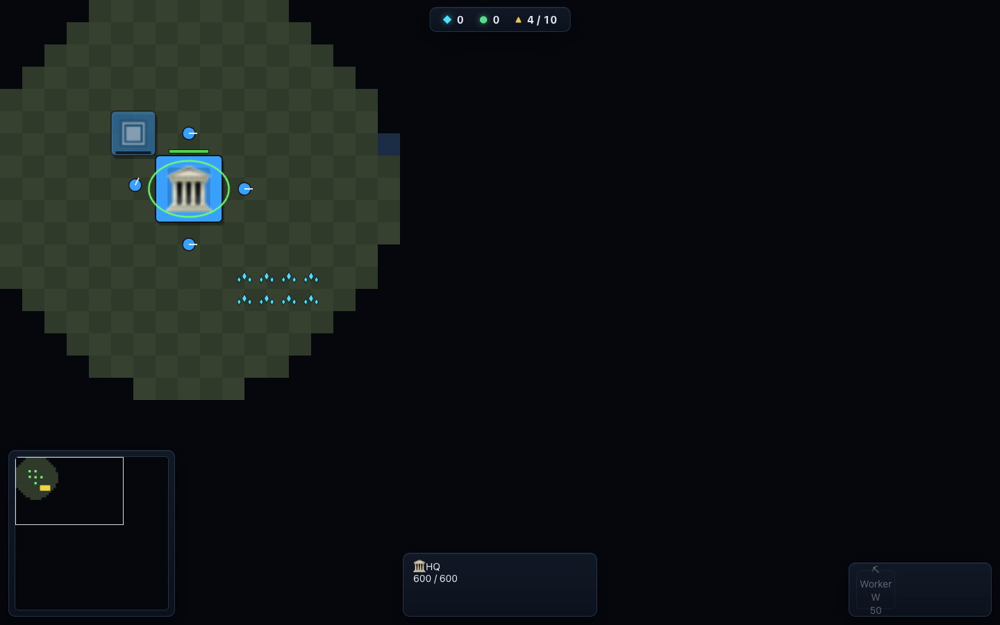
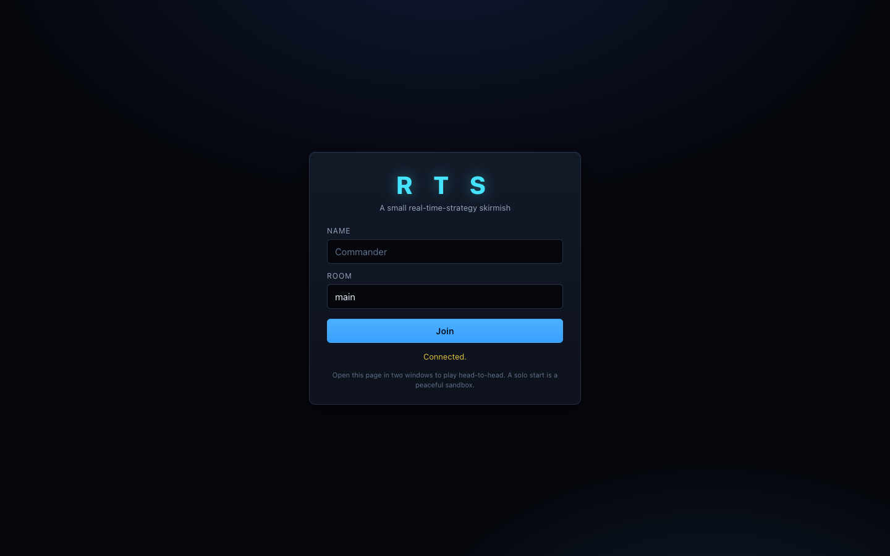

# Bewegungskrieg

A small but complete real-time-strategy game with a neutral World War II-inspired,
PlayStation 1-style presentation — gather resources, build a base, train an army, scout
through fog of war, and wipe out your opponent.
Server-authoritative multiplayer with a **Rust** server (axum + tokio) and a zero-build
**HTML/CSS/JS + PixiJS** client. No sound.



> **Status:** v1 (focused MVP) — one faction, 5 unit types, 5 building types, 2 resources, fog of
> war, last-player-standing. Built to be iterated on for years; `DESIGN.md` is the source of truth
> for the architecture, wire protocol, module contracts, and balance.

## Features

- **Economy** — engineers latch onto steel and oil patches, mine in place, and deposit directly;
  nodes deplete.
- **Base building** — Industrial Center, Depot, Barracks, Training Centre, and Tank Factory,
  placed by engineers with live construction.
- **Army** — train Engineers, Riflemen, Machine Gunners, AT Teams, and Tanks; supply cap gates
  your population.
- **Fog of war** — server-authoritative and cheat-proof: you never receive entities you can't see.
  Explored terrain stays revealed; the active vision around your units is clear.
- **Multiplayer** — lobby + rooms, 2–4 players, fog-filtered snapshots, last-player-standing win.
  A solo start is a peaceful sandbox.
- **Low-res field look** — muted PS1-style procedural art, smooth snapshot interpolation,
  minimap, command card, and no historical faction iconography.

## Quick start

You need a recent Rust toolchain (`cargo`). There is **no JS build step** — the client is plain ES
modules and loads PixiJS from a CDN. The Rust process serves both the client and the WebSocket.

```bash
cd server
cargo run --release          # then open the printed URL
```

To play head-to-head, open the page in **two browser windows**, join the same room, both click
**Ready**, and the host clicks **Start match**. Set `RTS_ADDR` to change the bind address
(default `0.0.0.0:8080`).

## Deploy

The app is configured for Fly.io via [`fly.toml`](fly.toml). After making a
change, deploy from the repo root with:

```bash
flyctl deploy --ha=false
```

The first-time setup steps, app name, and machine management commands live in
[`docs/fly.md`](docs/fly.md).



## Controls

| Action | Input |
|--------|-------|
| Select unit / building | Left-click |
| Box-select | Left-drag |
| Move / gather / attack (context-sensitive) | Right-click |
| Command card | Grid hotkeys: Q W E / A S D / Z X C (top-left is Q) |
| Pan camera | WASD / arrow keys / screen edge / drag minimap |
| Zoom | Mouse wheel |
| Build (worker selected) | Command-card buttons, then click to place; `Esc`/right-click cancels |
| Train (Industrial Center / production building selected) | Command-card buttons |

## How it works

The **server** runs the one authoritative simulation per room at a fixed 30 Hz tick. Clients send
only **commands** (intent); they never mutate game state. Each tick the server produces a
**per-player snapshot** with fog of war applied — hidden enemies are simply not sent, so the fog is
a real security boundary. The **client** renders snapshots, interpolating positions between them for
smoothness, and draws the fog overlay locally from its own units' sight.

```
Browser (PixiJS) ──ClientMessage (JSON/WS)──▶ Rust server (axum+tokio)
   lobby / input / camera                       static files + /ws
   renderer / fog / minimap  ◀──ServerMessage── Lobby ▸ Room ▸ Game (authoritative)
```

See **`DESIGN.md`** for the full architecture, the wire protocol, every module's contract, the
`Game` API seam, and the balance table.

## Project layout

```
server/        Rust authoritative server (also serves the client)
  src/
    main.rs        tokio + axum: static files, /ws upgrade, connection tasks
    protocol.rs    serde wire types         ── keep in sync with client/src/protocol.js
    config.rs      balance constants (authoritative) ── mirrored by client/src/config.js
    lobby.rs       rooms, lobby, per-room tick loop
    game/          the simulation: map, entity, pathfinding, fog, systems, mod (Game API)
client/        HTML/CSS/JS client (PixiJS v7 via CDN), served at /
  index.html, styles.css
  src/           net, state, camera, renderer, fog, input, hud, minimap, lobby, main
DESIGN.md      architecture, wire protocol, module contracts, balance, hardening  ← read first
tests/         end-to-end tests (run against a live server) — see tests/README.md
```

## Gameplay & balance (v1)

Start with 1 Industrial Center, 4 engineers, 50 steel. Supply cap starts at 10 and grows
+8 per Depot.

| Unit    | HP  | Dmg | Range | Sight | Cost          | Supply |
|---------|-----|-----|-------|-------|---------------|--------|
| Engineer | 40  | 4   | 1     | 7     | 50 steel | 1      |
| Rifleman | 45  | 5   | 4     | 8     | 50 steel | 1      |
| Machine Gunner | 55 | 4 | 5   | 8     | 75 steel/25 oil | 2      |
| AT Team | 45  | 48  | 5     | 8     | 75 steel/25 oil | 2      |
| Tank    | 390 | 60  | 3     | 7     | 200 steel/100 oil | 6      |

| Building | HP  | Cost   | Footprint | Notes |
|----------|-----|--------|-----------|-------|
| Industrial Center | 600 | 400 steel | 3x3 | trains Engineers, +10 supply (start free) |
| Depot | 220 | 100 steel | 2x2 | +8 supply |
| Barracks | 320 | 150 steel | 3x2 | trains Riflemen, Machine Gunners, AT Teams |
| Training Centre | 300 | 100 steel/50 oil | 3x2 | unlocks support infantry |
| Tank Factory | 360 | 200 steel/100 oil | 3x3 | trains Tanks |

Balance lives in `server/src/config.rs` (authoritative); the UI subset is mirrored in
`client/src/config.js`. Change both together.

## Testing

End-to-end tests run against a live server (start it first with `cargo run`):

```bash
node tests/server_integration.mjs    # no deps; full server pipeline over WebSocket (22 checks)
node tests/regression.mjs            # no deps; hardening/DoS/robustness guards (5 checks)
cd server && cargo test scripted_self_play_exercises_economy_tech_and_combat
cd tests && npm install && node client_smoke.mjs   # headless-Chrome client smoke (19 checks)
```

See `tests/README.md` for details and a CI sketch.

## Security / hardening

The server treats every client as untrusted: bounded WebSocket frames, deduped/capped command
unit lists, bounds-checked placement (no tick-loop panics), an idle timeout + client heartbeat to
evict stuck connections, and authoritative fog for entities, attack tracers, and death events.
See `DESIGN.md §7`.

## Known future work

- Spectators.
- Upgrade PixiJS v7 → v8 (async `Application.init`).
- A binary wire format for scale.
