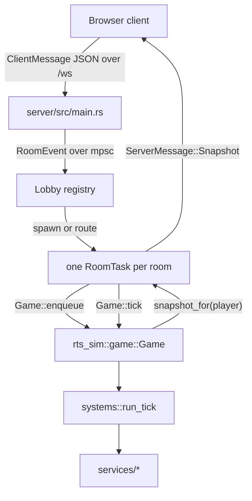
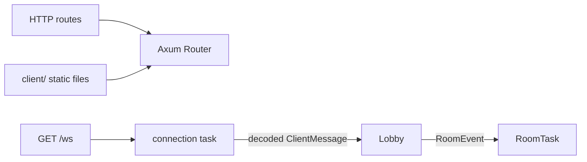
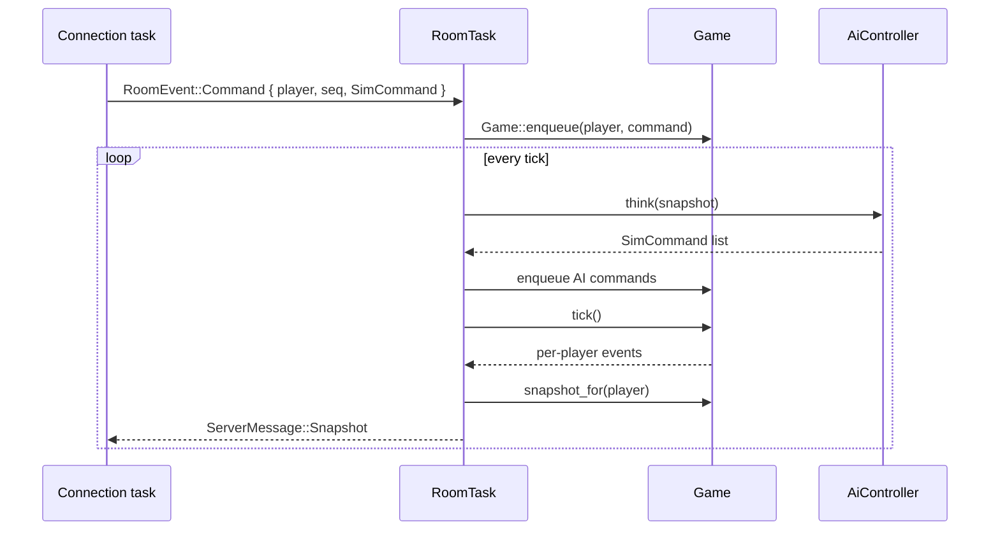
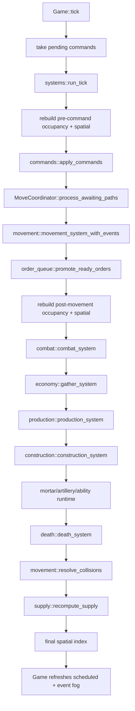
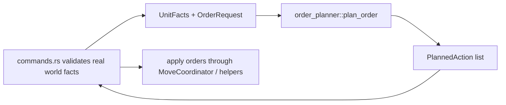
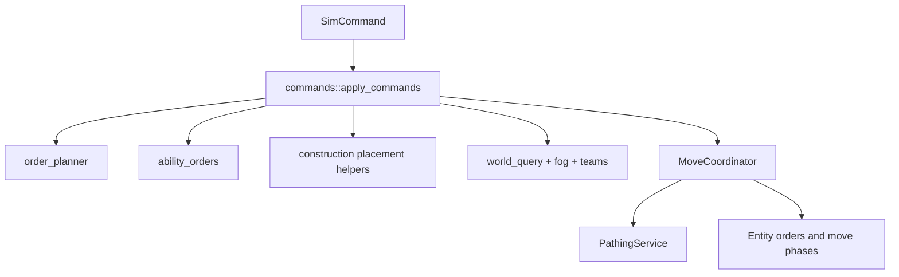
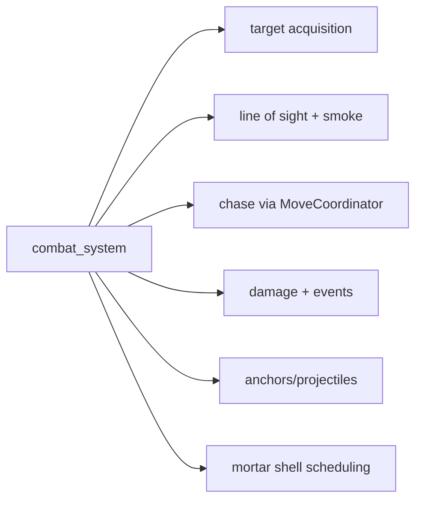
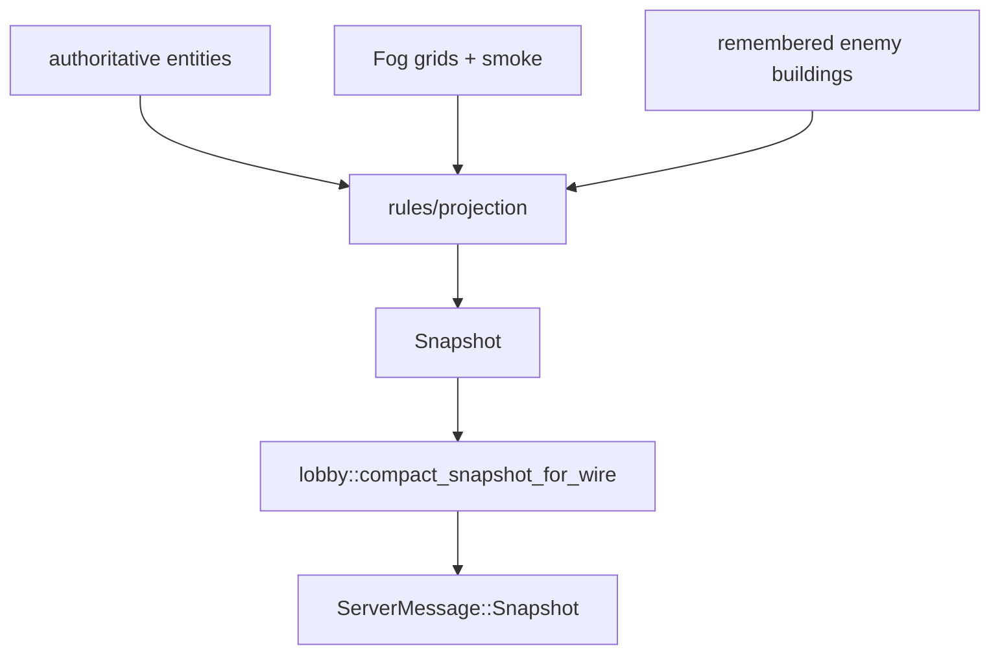

# Server Architecture Walkthrough

This is a plain-language map of the Rust server: what owns what, how data moves,
which APIs connect the pieces, and where the service layer is loosely or tightly
coupled.

It is a companion to [architecture.md](architecture.md) and
[server-sim.md](server-sim.md). Those remain the contract docs. This file is
for understanding the shape of the system before changing it.

## The Short Version

The server is three nested systems:

1. The process shell in `server/src/main.rs` serves HTTP routes, static client
   files, and WebSocket upgrades.
2. The lobby layer in `server/src/lobby/` owns rooms. Each room is one Tokio
   task, and that task is the only owner of its live `Game`.
3. The simulation crate in `server/crates/sim/` owns the authoritative RTS
   world. `Game::tick()` runs a fixed sequence of services, then `Game` builds
   fog-filtered snapshots for each player.

The most important boundary is the `Game` public API. The networking and lobby
code do not reach into simulation internals. They enqueue commands, tick the
game, and ask for snapshots.

## Coupling Scale

Coupling here means "how much one piece needs to know about another piece."

| Coupling | Meaning in this codebase |
| --- | --- |
| Low | A narrow API, usually read-only inputs or plain data, with little knowledge of tick order. |
| Medium | The caller must pass several state handles or phase-specific derived indexes, but the service still has one clear job. |
| High | The service mutates several parts of the world, depends on tick order, or knows multiple gameplay rules at once. |

High coupling is not automatically wrong in a game simulation. Some systems,
like command validation and combat, really do need broad context. It is a risk
flag: changes there should be smaller and tested closer to the behavior.

## Phase 1: The Server Shell

The executable starts in `server/src/main.rs`.

It creates the Axum router, serves the JS client, exposes utility routes like
`/version`, `/wiki`, `/dev/scenarios`, `/dev/replay-artifact`, `/api/lobbies`, `/api/matches`, and
upgrades `/ws` to a WebSocket. It also builds one shared `Lobby`.

`GET /api/lobbies` returns browser-safe summaries for public normal rooms and persisted replay
staging lobbies: room name, kind, current host name, map, creation time, occupied active slots, max
slots, spectator count, phase, and server-authored join state. `POST /api/lobbies` reserves a new
normal lobby name with create-only semantics; duplicate, invalid, reserved/internal, and
deploy-drain attempts fail instead of routing through the normal join-or-create WebSocket path.

`main.rs` does not own a `Game`. It is the edge of the server, not the
simulation.

The connection task reads client WebSocket frames, decodes protocol messages,
and sends room events into the lobby/room layer. Outbound messages go through a
connection sink. Reliable messages use a bounded queue, while snapshots use a
replace-latest path so stale snapshots do not pile up behind a slow client.

### Server Shell API Map

| Owner | Main APIs | Coupling | Why |
| --- | --- | --- | --- |
| `main.rs` | Axum route handlers, `ws_handler`, `handle_connection` | Medium | It knows HTTP/WebSocket routing and protocol envelopes, but not sim internals. |
| `Lobby` | room lookup/create, room event sender, replay room creation, drain state | Medium | It owns room registry and process-wide coordination, but sends messages instead of mutating rooms directly. |
| `ConnectionWriter` / connection sink | `send_or_log`, latest snapshot slot, reliable queue | Low to medium | Narrow delivery API; coupling rises because snapshot delivery has performance/backpressure policy. |
| protocol DTOs | `ClientMessage`, `ServerMessage`, compact snapshot encoding | Medium | Wire shape is shared with client and replay paths, so changes are contract changes. |

## Phase 2: Rooms, Lobby State, and Live Ticks

A room is the server's unit of ownership. One room task owns one room's lobby
state and, during a match, one `Game`.

Players do not mutate the room directly. Connections send `RoomEvent`s over an
MPSC channel. The room task runs a loop that alternates between:

1. Receiving room events, such as join, ready, command, give up, replay seek.
2. Running scheduled ticks.

`RoomTask` owns lifecycle: who is in the lobby, who is host, team/faction
assignment, AI slots, whether the room is in lobby, live game, replay viewer, or
branch staging mode, and when a match starts or ends.

`LiveTickDriver` owns the live-match tick wrapper. It asks AI controllers for
ordinary `SimCommand`s, calls `Game::tick_with_perf`, fans out snapshots, sends
observer analysis, checks victory, and catches simulation panics so the room can
write a crash replay instead of silently losing the match.

### Room Layer API Map

| Owner | API between systems | Coupling | Why |
| --- | --- | --- | --- |
| `RoomEvent` | `Join`, `Leave`, `Ready`, `StartRequest`, `Command`, replay and branch events | Low | Plain message enum. It decouples connection tasks from room state. |
| `RoomTask` | `run(event_rx)`, `handle_event`, `on_tick`, phase transition helpers | High | It owns membership, lifecycle, match starts, match ends, replay transitions, AI slots, and the live `Game`. |
| `LiveTickDriver` | `run(Box<Game>) -> LiveTickResult` | Medium to high | It is narrower than `RoomTask`, but knows AI enqueue, snapshots, defeat/game-over, perf, and panic capture. |
| `AiController` | `think(AiThinkContext) -> Vec<SimCommand>` | Low | AI only sees start payload, fog-filtered snapshot, alive ids, and retreat commands. It returns normal player commands. |
| `SnapshotFanout` | `send_to_recipients(players, recipients, snapshot_for)` | Medium | Delivery is narrow, but it mutates net-status fields and tracks backpressure/perf. |
| `ReplaySession` | replay seek/speed/vision/start payload/snapshot helpers | Medium | Replay owns playback state, but still drives a rebuilt `Game` through the same sim API. |
| `ReplayBranch` | branch staging and seat claim/release/launch data | Medium | Branching is isolated from live tick code, but tied to room membership and replay seats. |

## Phase 3: The Simulation and Services

`rts_sim::game::Game` is the authoritative world. It stores the map, entity
store, fog grids, player state, pending commands, command log, persistent
pathing cache, smoke clouds, ability runtime, delayed shells, replay metadata,
and debug/perf state.

The public API used by the server layer is intentionally small:

| `Game` API | Used for |
| --- | --- |
| `new(...)` and replay constructors | Create live or replay simulation state from lobby/replay player records. |
| `start_payload()` | Send terrain, starts, and setup data once at match start. |
| `enqueue(player, SimCommand)` | Queue a command; validation happens when the tick applies it. |
| `worker_retreat_commands_for(player)` | Let AI ask for a narrow sim-derived reflex without reading private entity state. |
| `tick()` / `tick_with_perf()` | Advance the authoritative world by one fixed tick. |
| `snapshot_for(player)` | Build one player's fog-filtered snapshot. |
| `snapshot_for_spectator(players)` | Build a union-fog spectator snapshot. |
| `snapshot_full_for(player)` | Dev-only full-world watch snapshot. |
| `alive_players()`, `alive_team_ids()`, `scores()` | Room outcome and score-screen data. |
| `command_log()`, `player_inits()` | Replay and crash artifact data. |
| `eliminate(player)` | Remove a leaving player's army so matches can resolve. |

`Game::tick()` increments the tick counter, drains pending commands, and calls
`systems::run_tick`. After the services finish, it recomputes ordinary live fog at 15 Hz (or when
smoke/building occlusion changes), refreshes event-driven visibility every tick, and
refreshes remembered enemy buildings.

The services are not independent actors. They are ordinary Rust functions called
in a strict order. The order matters because each phase sees a particular view
of the world:

1. Pre-command derived state is valid before commands mutate orders.
2. Post-movement derived state is valid after units move.
3. Pre-collision derived state is valid after damage, production, construction,
   and death, but before collision cleanup.
4. Final spatial state is valid for snapshot interest filtering.

### Simulation Service API Map

| Service | Main API | Coupling | Notes |
| --- | --- | --- | --- |
| `systems.rs` | `run_tick(map, entities, players, fog, pathing, rng, stores, pending, events, tick, perf) -> SpatialIndex` | High | It is the orchestrator. It knows every phase, rebuild point, and service call order. |
| `commands.rs` | `apply_commands(... pending: Vec<(player, SimCommand)> ...)` | High | Validates ownership, command budgets, costs, tech, faction legality, placement, fog, ability use, and order application. |
| `order_planner.rs` | `plan_order(config, facts, request) -> PlannerOutput` | Low | Pure policy. It does not mutate the world and uses plain facts/actions. |
| `order_execution.rs` | focused helpers for setup, teardown, artillery point-fire orders | Medium | Shared mutation helpers reduce duplication between issue-time commands and queued promotion. |
| `move_coordinator.rs` | `order_group_move`, `order_attack`, `order_gather`, `order_build`, `order_ability`, `process_awaiting_paths` | High | Central movement/order gateway. It wraps pathing, occupancy, spawn search, formation spread, and order state. |
| `pathing.rs` | `PathingService::request`, `advance_tick`, cached tile paths | Medium | Stateful cache and per-tick budgeting, but isolated from combat/economy rules. |
| `movement/` | `movement_system_with_events`, `resolve_collisions` | Medium to high | Owns waypoint advancement, vehicle steering, smoke movement status, cooldown ticks, and collision cleanup. |
| `combat/` | `combat_system(...)` | High | Needs teams, LOS, fog, smoke, spatial index, move coordinator, ability runtime, mortar shells, RNG, and events. |
| `economy.rs` | `gather_system(map, entities, players, occ, spatial, coordinator, tick)` | Medium | Focused on gatherers/resources, but mutates gatherers, resources, player stockpiles, mined-income counters, and paths. |
| `production.rs` | `production_system(map, entities, players, coordinator, events)` | Medium | Advances queues, spends completed production, and asks coordinator for spawn/rally positions. |
| `construction.rs` | `construction_system(map, entities, players, events, fog, active_sites)` | Medium to high | Tied to build orders, placement legality, faction/economy rules, progress, and notices. |
| `ability_orders.rs` | `order_or_launch_world_ability`, `launch_world_ability`, `launch_self_ability`, predicates | High | Ability legality and effects span commands, queued orders, resources, cooldowns, smoke, runtime stores, and events. |
| `ability_runtime.rs` | projectile/anchor/return-marker tick and state helpers | Medium | Owns persistent ability state; combat and ability orders both touch it. |
| `mortar.rs` / `artillery.rs` | delayed shell `schedule` and `resolve_due` | Medium | Small stores, but resolution applies combat damage/events and depends on team/fog policy. |
| `death.rs` | `death_system(entities, fog, smokes, teams, players, lingering_sight, events, tick)` | High | Death affects entities, scoring, lingering sight, resource cleanup, smoke/runtime cleanup, and event routing. |
| `supply.rs` | `recompute_supply(players, entities)` | Low | Narrow recalculation from authoritative entity state. |
| `occupancy.rs` | `Occupancy::build`, footprint and clearance queries | Low | Derived read model over map/entities. Rebuilt by the orchestrator at phase boundaries. |
| `spatial.rs` | `SpatialIndex::build`, rectangle/circle id queries | Low | Derived index with a narrow query API. |
| `geometry.rs` | body/rect/intersection helpers | Low | Pure geometry helpers. |
| `standability.rs` | static placement/body legality helpers | Medium | Mostly pure, but knows map, occupancy, spatial index, and unit/building body rules. |
| `line_of_sight.rs` | `LineOfSight::clear_between_world_points`, smoke-aware LOS | Low | Narrow read-only query surface. |
| `world_query.rs` | owned/enemy/nearest query helpers | Medium | Read-only queries, but encode targetability and team relationship rules. |

### Important API Boundaries Inside the Tick

The cleanest boundary is command planning:

`order_planner` is low coupling because it does not know `EntityStore`, `Map`,
`Fog`, resources, or factions. It only knows facts and returns planned actions.

The highest-coupling area is command-to-order execution:

That coupling exists because player input crosses trust boundaries. The server
must check ownership, stale ids, max command sizes, team hostility, fog
visibility, faction legality, resources, tech, placement, queue length, and path
staging before mutating orders.

Combat is also tightly coupled:

This is expected for an RTS combat phase. The main safety rule is to keep the
coupling contained inside `combat/` and use narrower helper modules inside that
folder for acquisition, chase, weapons, projection, events, and damage.

## Snapshot and Fog Walkthrough

Snapshots are pulled after the tick, not pushed from inside services.

For normal players, `Game::snapshot_for(player)` builds a view from authoritative
state and hides enemies outside that player's living team vision. Spectators use
`snapshot_for_spectator(visible_players)`, which unions selected players' current
fog. Dev watch paths may use `snapshot_full_for`, but normal gameplay must not.

The coupling here is deliberately split:

| Piece | Coupling | Why |
| --- | --- | --- |
| `Game::snapshot_for` | Medium | It reads many world stores, but does not advance simulation. |
| `rules/projection.rs` | Medium | It is the central visibility policy exception that reads sim state to produce protocol views. |
| `compact_snapshot_for_wire` | Low | It only trims resource entities into compact resource deltas before wire send. |
| client rendering | Low to server internals | The client receives snapshots; it does not know `EntityStore` or tick services. |

## How To Read The Server Code

Start with the outer shell, then move inward:

1. Read `server/src/main.rs` to see routes, WebSocket upgrade, shutdown drain,
   match-history endpoints, and dev endpoints.
2. Read `server/src/lobby/mod.rs` for the room concurrency model and the
   `RoomEvent` message contract.
3. Read `server/src/lobby/room_task.rs` for lifecycle: join, ready, start,
   leave, lobby state, replay state, branch state, and match reset.
4. Read `server/src/lobby/live_tick.rs` for what happens during one live room
   tick around `Game`.
5. Read `server/crates/sim/src/game/mod.rs` for what `Game` stores and exposes.
6. Read `server/crates/sim/src/game/systems.rs` for the exact service order.
7. Read individual files under `server/crates/sim/src/game/services/` only when
   you need one gameplay phase.

The main mental model is:

> Connections send intent. Rooms serialize that intent. `Game` applies it in a
> deterministic tick. Services mutate the world in a fixed order. Snapshots are
> derived views of the authoritative world.

## Change Risk Guide

| Change area | Risk | Reason |
| --- | --- | --- |
| Pure helpers like `geometry`, `line_of_sight`, `supply` | Lower | Narrow inputs and outputs. Focused tests are usually enough. |
| `order_planner` | Lower to medium | Pure and easy to unit test, but affects all command ordering. |
| Snapshot projection/fog | High | A mistake can leak hidden information or hide legal information. Check protocol and fog docs. |
| `commands`, `combat`, `move_coordinator`, `ability_orders`, `death` | High | These mutate several stores and rely on tick order. Use focused behavior tests. |
| `Game` public API | High | This is the lobby/sim seam. Update design docs and all callers together. |
| protocol DTOs | High | Server, client, replay, and docs must agree. |

## Glossary

| Term | Meaning |
| --- | --- |
| Room task | One Tokio task that owns one room and its `Game`. |
| `RoomEvent` | Internal message from connections/lobby into a room task. |
| `SimCommand` | Domain command queued into `Game`; not raw socket metadata. |
| `EntityStore` | Authoritative collection of units, buildings, resource nodes, and their mutable state. |
| Occupancy | Derived map/building clearance state for pathing and placement. |
| Spatial index | Derived broad-phase entity index for nearby queries. |
| Fog | Server-authoritative visibility grids. |
| Service | A function/module called by `systems::run_tick` for one simulation phase or shared query surface. |
| Projection | Conversion from authoritative state into a player-safe protocol view. |
